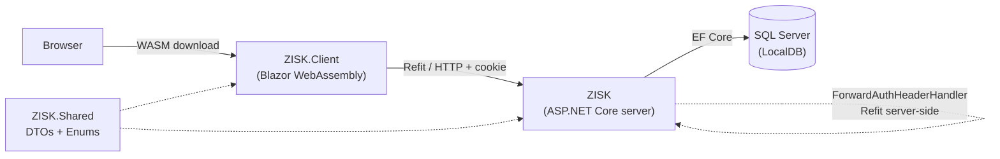

# ZISK — Sports Club Management System

**Attendance, training scheduling, and parent–coach communication for a sports club.**
Bachelor's thesis project built on ASP.NET Core 10 + Blazor WebAssembly, with a
5-role authorization model, three background workers, and a full xUnit test suite.

[](https://github.com/Miclah/ZISK/actions/workflows/ci.yml) [](https://dotnet.microsoft.com/) [](https://mudblazor.com/) [](LICENSE)

---

## At a glance

- **Hybrid Blazor hosting**: one ASP.NET Core project serves both the WASM client and the REST API — no CORS, shared cookie auth, single deployment
- **5-role authorization** (Admin, Coach, Parent, Athlete, Child) enforced across three independent layers: UI (`AuthorizeView`), declarative (`[Authorize(Roles=...)]`), and object-level (`TeamAccessService` — a coach can only ever see their own teams' data)
- **13 REST controllers**, 13 typed Refit clients shared between the WASM app and server-side Razor pages — one interface defines the contract for both
- **3 background workers**: automatic attendance close-out, recurring training-series generation from a weekday bitmask, and automatic Child→Athlete promotion by age
- **13 xUnit test classes** covering attendance automation, password/email flows, parent invitations, training cancellation, and more

## Live demo

Not deployed yet — an Azure App Service (free tier) deployment is in progress. This section will be updated with a URL and demo credentials once it's live.

## Screenshots

_Coming once the live demo is up — planned: admin dashboard, coach training detail (attendance chips), parent excuse submission._

## Architecture



One ASP.NET Core project hosts both the compiled WASM client and the API. Server-side
Razor pages (login, registration, password reset — anything that needs to set an
`HttpOnly` cookie) also call the API, through the same Refit interfaces the WASM
client uses, via a `ForwardAuthHeaderHandler` that forwards the auth cookie on
server-to-server calls. `ZISK.Shared` holds the `record` DTOs and enums referenced
by both client and server, so a JSON contract change is a compile error on both
sides instead of a runtime surprise.

## Tech stack

| Layer | Technology | Version |
|---|---|---|
| Framework | .NET | 10 |
| UI | Blazor WebAssembly + Server (hybrid) | .NET 10 |
| Component library | MudBlazor | 9.4.0 |
| Calendar | Heron.MudCalendar | 4.0.0 |
| ORM | Entity Framework Core | 10.0.5 |
| Database | SQL Server (LocalDB for dev) | — |
| Auth | ASP.NET Core Identity (cookie, `HttpOnly`, 14-day sliding) | — |
| Typed HTTP client | Refit | 10.1.6 |
| Email | MailKit | 4.16.0 |
| Testing | xUnit + EF Core InMemory | 2.9.3 |

## Features by role

| Role | Can do |
|---|---|
| **Admin** | Full club management: users, teams, seasons, system-wide announcements, club statistics |
| **Coach** | Manage trainings and recurring series for assigned teams, mark attendance, review excuses, team announcements |
| **Parent** | View their children's schedule and attendance, submit/edit excuses, invite a second parent |
| **Athlete** | Same as Parent, scoped to themselves (self-managed excuses once past the age threshold) |
| **Child** | Read-only dashboard — schedule and announcements; a parent manages excuses on their behalf |

**Automated attendance**: a training is auto-marked Present 10+ minutes after its
start time for any member without a manual record; if a matching excuse exists
(exact training or a date-range overlap), the member is marked Excused instead.

## Getting started

**Prerequisites:** [.NET SDK 10.0+](https://dotnet.microsoft.com/download), SQL Server LocalDB (bundled with Visual Studio, or install separately).

```bash
git clone https://github.com/Miclah/ZISK.git
cd ZISK
dotnet restore ZISK/ZISK.sln
dotnet run --project ZISK/ZISK/ZISK.csproj
```

The app runs at **http://localhost:5224**. On first run it applies EF Core
migrations and seeds roles, four core accounts, teams, a season, and sample data
(see [Demo accounts](#demo-accounts) below).

## Configuration & secrets

Connection string, SMTP credentials, and seed passwords do not belong in
`appsettings.json` once this leaves your machine. For local development:

```bash
dotnet user-secrets init --project ZISK/ZISK
dotnet user-secrets set "Smtp:Password" "..." --project ZISK/ZISK
```

Configurable settings: `ConnectionStrings:DefaultConnection`, `Smtp:Host/Port/Username/Password`,
`ZISK_SEED_MODE`, `Seed:Passwords:*` (demo mode), `Seed:InitialAdmin:Email/Password` (production mode).

## Demo accounts

Seeding behavior is controlled by the `ZISK_SEED_MODE` environment variable:

| Mode | Purpose | Passwords |
|---|---|---|
| `local` (default) | `dotnet run` on your own machine | Hardcoded, listed below |
| `demo` | Public deployment (e.g. Azure) | Read from `Seed:Passwords:*` config; startup fails loudly if any are missing. Real email sending is also disabled in this mode — a public demo has no business emailing arbitrary addresses. |
| `production` | Real deployment | No demo/sample data at all — only roles + one admin from `Seed:InitialAdmin:*` |

Local dev accounts (`local` mode):

| Role | Email | Password |
|---|---|---|
| Admin | admin@zisk.sk | Admin1234 |
| Coach | trener@zisk.sk | Trener1234 |
| Parent | rodic@zisk.sk | Rodic1234 |
| Child | dieta@zisk.sk | Dieta1234 |

Roughly 25 additional sample coaches/parents/athletes/children are seeded for
realistic team rosters and attendance history; they reuse the same per-role
passwords above rather than having individual credentials.

## Testing

```bash
dotnet test
```

13 xUnit test classes (94 test cases) covering automated attendance close-out,
password/email change flows, forgotten-password rate limiting, Child→Athlete
upgrade, parent invitations, training cancellation and series generation,
username generation, and the seed-mode/demo-email configuration logic above.

## What I learned

**Designing team-scoped authorisation was the hardest call.** Every endpoint had
to answer two independent questions — "does this role allow the action?" and
"is this user in the right team?" — and putting the team check inside each
controller meant duplicating it across dozens of methods. I settled on a single
`TeamAccessService.GetAccessibleTeamIdsAsync()` that returns `null` for admins
(no filter) and an explicit `HashSet<Guid>` for everyone else. Services use it
as a `.Where()` predicate against the EF query, so the authorisation rule lives
in one place instead of being scattered across controllers. (There are still a
few endpoints where I haven't wired this check in yet — fixing the remaining
gaps is next on my list.)

**I hadn't heard of Refit before** — an AI suggestion when I was sketching out
how the WASM client would talk to the API. I had been about to write a service
class for each controller wrapping `HttpClient.PostAsJsonAsync(...)` calls by
hand. With Refit, every API contract is a one-method-per-endpoint interface and
the implementation is generated at compile time. Across thirteen `IXxxApi`
interfaces it saved several hundred lines of boilerplate and meant that a typo
in a route or DTO field is a compile error instead of a runtime 404.

**The biggest plan-vs-reality gap was the registration form.** I originally
wanted parents to pick their home address from an interactive OpenStreetMap
component — type-ahead search, drop a pin, save lat/long with the address.
After a few days of prototyping I realised it would mean a third-party
JavaScript library inside a Blazor WASM page, a different database column shape,
and ongoing reliance on a tile server I didn't control. None of that was
justified by the actual use case — coaches and admins never needed to query
parents by location. I cut it down to a plain text address field. A reminder
that "cool to build" is not the same as "worth building".

## License

MIT — see [LICENSE](LICENSE).

## Author

Michal Petrán — Faculty of Management Science and Informatics, University of
Žilina (FRI UNIZA). Bachelor's thesis project, 2026.
