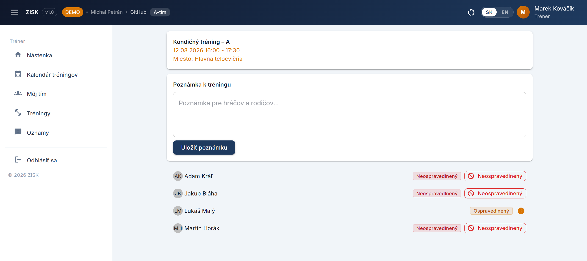
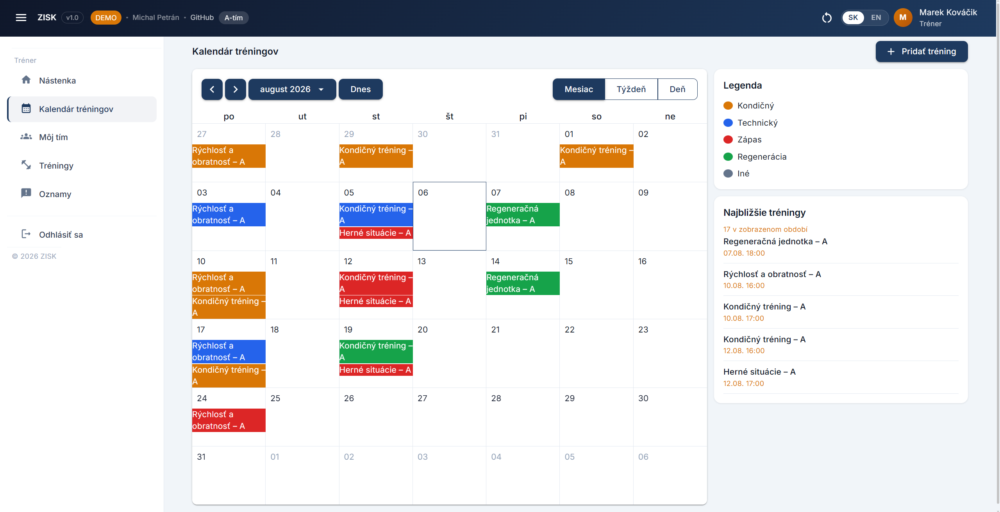
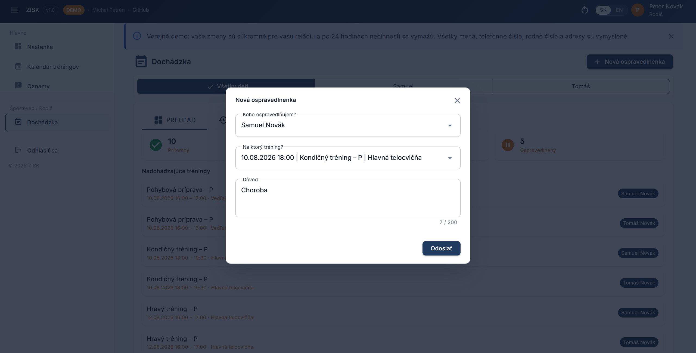

[English](README.md) | **Slovenčina**

# ZISK

Dochádzka, rozvrh tréningov a komunikácia medzi rodičmi a trénermi v športovom klube. Jeden .NET 10 server, ktorý hostuje REST API aj Blazor WebAssembly klienta.

[](https://github.com/Miclah/ZISK/actions/workflows/ci.yml)
[](LICENSE)

## Obsah

- [Živé demo](#živé-demo)
- [O projekte](#o-projekte)
- [Funkcie podľa rolí](#funkcie-podľa-rolí)
- [Screenshoty](#screenshoty)
- [Technológie](#technológie)
- [Architektúra](#architektúra)
- [Demo režim](#demo-režim)
- [Spustenie lokálne](#spustenie-lokálne)
- [Konfigurácia a citlivé údaje](#konfigurácia-a-citlivé-údaje)
- [Deployment](#deployment)
- [Odinštalovanie](#odinštalovanie)
- [Licencia](#licencia)
- [Autor](#autor)

## Živé demo

**[miclah-zisk.azurewebsites.net/demo](https://miclah-zisk.azurewebsites.net/demo)**

Kliknete na rolu a ste prihlásený. Bez hesla, bez registrácie. Dáta, ktoré uvidíte, sú vaša vlastná kópia, takže si v nich môžete robiť čo chcete.

Beží to na bezplatnej Azure vrstve, ktorá aplikáciu aj databázu uspí, keď ich chvíľu nikto nepoužíva. Prvé načítanie po takej pauze trvá asi pol minúty. Potom už je to normálne rýchle.


## O projekte

ZISK je skratka pre *Žiarsky Informačný Systém pre športové Kluby*.

Robil som ho pre mestský športový klub v Žiari nad Hronom a odovzdal ako bakalársku prácu na Fakulte riadenia a informatiky Žilinskej univerzity. Nasadenie v klube je plánované na august 2026.

Rozhranie je po slovensky aj po anglicky.

## Funkcie podľa rolí

**Admin**

- Zakladá, upravuje, deaktivuje a maže účty vo všetkých piatich rolách
- Spravuje tímy a súpisky, prideľuje trénerov k tímom
- Vytvára sezóny, prepína aktívnu a plánuje jednorazové aj opakované tréningy
- Vidí štatistiky dochádzky za celý klub a publikuje systémové oznamy

**Tréner**

- Vidí súpisku a ospravedlnenky tímov, ktoré má pridelené
- Otvorí si tréning a prejde, kto prišiel, kto nie a kto sa ospravedlnil
- Zapíše hráčovi neospravedlnenú absenciu. Je to jediný manuálny zásah do dochádzky v celej aplikácii
- Píše oznamy svojmu tímu

**Rodič**

- Sleduje rozvrh a dochádzku svojich detí
- Podáva a upravuje ospravedlnenky za dieťa, buď na jeden tréning, alebo na rozsah dní
- Pozve k dieťaťu druhého rodiča, e-mailovým odkazom alebo jednorazovým kódom

**Športovec**

- To isté čo rodič, len sám za seba
- Podáva si vlastné ospravedlnenky

**Dieťa**

- Rozvrh, dochádzka a oznamy, iba na pozeranie
- Ospravedlnenky zaň rieši rodič

Rozdiel medzi Dieťaťom a Športovcom je vek. Keď dieťa prekročí vekovú hranicu, background worker mu rolu prehodí a účet si odvtedy vie ospravedlnenky podávať sám.

### Ako funguje dochádzka

Dochádzka sa uzatvára sama. Desať minút po začiatku tréningu sa každý, kto bol v tíme už pred ním, označí ako prítomný. Ak naňho sedí ospravedlnenka, teda menuje priamo ten tréning alebo mu len prekrýva dátum, dostane stav ospravedlnený. Tréner do toho vstupuje jedine vtedy, keď niekto neprišiel a ani sa neozval.

## Screenshoty

### Tréner - zápis dochádzky


### Kalendár tréningov


### Rodič - podanie ospravedlnenky


## Technológie

| Vrstva | Technológia | Verzia |
|---|---|---|
| Framework | .NET | 10.0 |
| Klient | Blazor WebAssembly | 10.0.5 |
| Server | ASP.NET Core, Static SSR pre Identity stránky | 10.0.5 |
| Knižnica komponentov | MudBlazor | 9.4.0 |
| Kalendár | Heron.MudCalendar | 4.0.0 |
| ORM | Entity Framework Core (SQL Server) | 10.0.5 |
| Databáza | SQL Server: lokálne LocalDB alebo Docker, pre demo Azure SQL serverless | 2022 |
| Typovaný HTTP klient | Refit | 10.1.6 |
| Autentifikácia | ASP.NET Core Identity, cookie, 14-dňová klzná platnosť | 10.0.5 |
| E-mail | MailKit | 4.16.0 |
| Testy | xUnit s EF Core InMemory | 2.9.3 |

## Architektúra


Jeden ASP.NET Core projekt servíruje skompilovaného WebAssembly klienta aj REST API z tej istej domény. Odpadá tým CORS a oboje zdieľa jednu autentifikačnú cookie. Klient volá API cez 14 Refit rozhraní: jedna metóda na endpoint, implementáciu dopĺňa generátor pri kompilácii.

Prihlásenie a registrácia musia nastaviť `HttpOnly` cookie, čo sa z WebAssembly spraviť nedá, takže tieto stránky bežia ako Static SSR na serveri. Volajú tie isté Refit rozhrania, len cez `ForwardAuthHeaderHandler`, ktorý pri server-to-server volaní posunie cookie ďalej.

V `ZISK.Shared` sú DTO record typy, enumy a slovensko-anglická prekladová tabuľka. Referencuje ho klient aj server, takže keď niekto zmení kontrakt a zabudne na druhú stranu, spadne to pri builde a nie až v produkcii.

Kontrolery sú tenké a všetko podstatné delegujú na servisnú vrstvu, kde žijú biznis pravidlá aj LINQ. Tam sedí aj `TeamAccessService`, ktorý povie, ktoré tímy smie daný používateľ vidieť: admin všetky, tréner svoje pridelené, rodič tie, kde má dieťa. Popri request ceste beží päť background workerov. Uzatvárajú dochádzku, generujú inštancie opakovaných tréningov z bitmasky dní v týždni, menia deťom rolu podľa veku a udržiavajú demo dáta.

## Demo režim

Verejné demo je tá istá aplikácia, len s `ZISK_SEED_MODE=demo`. Nezdieľajú v ňom všetci návštevníci jedny dáta, každý dostane vlastné.

Keď si niekto na úvodnej stránke klikne rolu, server naklonuje celý naseedovaný template do novej demo session: tímy, používateľov aj s rolami, členstvá, tréningy, dochádzku, ospravedlnenky, oznamy. ID session ide do `HttpOnly` cookie a zároveň do claimu v autentifikačnej cookie. Entity, ktoré do session patria, implementujú `IDemoScoped` a `ApplicationDbContext` na 14 z nich vešia globálny EF Core query filter podľa `DemoSessionId`.

To je na tom to podstatné: izolácia žije v modeli, nie v dotazoch. Nemusel som kvôli nej siahnuť na jedinú službu ani kontroler a nový endpoint na ňu nemá ako zabudnúť, lebo si ju nepýta.

Naklonovaní používatelia dostanú prefix, teda `a1b2c3d4.admin@zisk.sk`. Dôvod je, že ASP.NET Identity si drží vlastný unique index nad normalizovaným menom a ten podľa session scopovaný nie je. Naše vlastné obmedzenia jedinečnosti, teda telefón, rodné číslo a názov tímu, scopované podľa `DemoSessionId` sú, takže klony dvoch návštevníkov si do cesty nevojdú.

To, čo návštevník robiť nesmie, je zablokované. E-maily namiesto skutočného odoslania končia v logu. Zmena hesla, zmena e-mailu aj zrušenie účtu vrátia chybu každému, kto je v demo session, a nahrávanie súborov je odmietnuté. Guard middleware odpovedá 404 na `/login`, `/registracia` a celý Identity scaffold, takže jediná viditeľná cesta dnu vedie cez úvodnú stránku. Aby databáza nerástla donekonečna, starajú sa o ňu dva workery: jeden maže session, ktoré sú 24 hodín ticho, druhý raz denne prerobí zdieľaný template, aby kalendár nezostal plný minulých tréningov. Keď je session naraz priveľa, vyhodí sa tá najdlhšie nepoužitá.

Tlačidlo reset zmaže dáta aktuálnej session, naklonuje čerstvú a návštevníka odhlási. Jeho účet bol totiž súčasťou toho, čo sa práve zmazalo.

## Spustenie lokálne

### S Dockerom

```bash
git clone https://github.com/Miclah/ZISK.git
cd ZISK
cp .env.example .env
```

V `.env` nastavte `MSSQL_SA_PASSWORD` na heslo, ktoré prejde cez politiku zložitosti SQL Servera: aspoň 8 znakov a 3 zo skupín veľké písmená, malé písmená, číslice, symboly. Potom:

```bash
docker compose up --build
```

Aplikácia beží na **http://localhost:8080**. Prvý štart spustí SQL Server, počká na jeho healthcheck, aplikuje EF Core migráciu a naseeduje databázu. Nabudúce už stačí `docker compose up`, prípadne `docker compose up -d`, ak to má bežať na pozadí.

Compose má predvolené `ZISK_SEED_MODE=local`, čiže bežné prihlasovanie a naseedované vývojárske účty. Ak chcete vidieť verejnú demo verziu, prepnite v `.env` na `ZISK_SEED_MODE=demo`.

Rebuild po zmene závislostí, mazanie databázového volume a chybu validácie NuGet podpisov, na ktorú sa dá pri čistom builde naraziť, rieši [DOCKER.md](DOCKER.md).

### Bez Dockera

Treba [.NET SDK 10.0](https://dotnet.microsoft.com/download) a SQL Server LocalDB, ktorý na Windowse chodí s Visual Studiom.

```bash
dotnet restore ZISK/ZISK.sln
dotnet run --project ZISK/ZISK/ZISK.csproj
```

Aplikácia beží na **http://localhost:5224**. Migrácie sa aplikujú a databáza sa naseeduje pri štarte, takže `dotnet ef database update` zvlášť spúšťať netreba. Novú migráciu po zmene modelu vytvoríte takto:

```bash
dotnet ef migrations add <Name> --project ZISK/ZISK/ZISK.csproj
```

### Vývojárske účty

V režime `local` sa naseedujú účty `admin@zisk.sk`, `trener@zisk.sk`, `rodic@zisk.sk` a `dieta@zisk.sk`. Heslá k nim sú natvrdo v `DatabaseInitializer.SeedPasswordSet.LocalDefault`. Okrem nich pribudne asi 25 vzorových trénerov, rodičov, športovcov a detí, aby súpisky, história dochádzky a štatistiky neboli prázdne. Heslo majú spoločné podľa roly.

### Testy

```bash
dotnet test
```

20 testovacích tried, 135 testov. Pokrývajú automatické uzatváranie dochádzky, hromadný zápis, zmene hesla a e-mailu, rate limitingu zabudnutého hesla, prechode z roly Dieťa na Športovec, pozvánkach rodičov, rušení tréningov, generovaní opakovaných sérií (vrátane toho, či manuálny endpoint a background worker vygenerujú to isté), generovaní používateľských mien, konfigurácii seed režimov, klonovaní a upratovaní demo session, integrite mazacích ciest a mapovaní API chýb.

## Konfigurácia a citlivé údaje

V repozitári nie je nič citlivé. V `appsettings.json` je len LocalDB connection string a necitlivé SMTP predvoľby. Lokálne sa hodí user secrets:

```bash
dotnet user-secrets init --project ZISK/ZISK
dotnet user-secrets set "Smtp:Password" "..." --project ZISK/ZISK
```

V Dockeri prídu hodnoty z `.env` a `docker-compose.yml`. Na Azure App Service sú to application settings, zapísané s dvojitým podčiarkovníkom (`Seed__Passwords__Admin`).

| Nastavenie | Účel |
|---|---|
| `ConnectionStrings__DefaultConnection` | Connection string na SQL Server |
| `ZISK_SEED_MODE` | `local`, `demo` alebo `production`. Predvolene `local` |
| `Seed__Passwords__Admin` / `Coach` / `Parent` / `Child` | Seed heslá. Čítajú sa len v režime `demo`. Ak niektoré chýba alebo porušuje politiku hesiel, štart zlyhá |
| `Seed__InitialAdmin__Email` / `Password` / `FirstName` / `LastName` | Jediný admin účet, ktorý vznikne v režime `production`. Ten neseeduje žiadne vzorové dáta |
| `Smtp__Host` / `Port` / `UseSsl` / `SenderName` / `SenderEmail` / `Username` / `Password` | Odchádzajúca pošta. V režime `demo` sa ignoruje, nahradí ju logovací sender |
| `Demo__OwnerKey` | Tajomstvo, ktorým sa správca dostane na demo nasadení k bežnému prihláseniu. Povinné pri `ZISK_SEED_MODE=demo` |
| `Demo__MaxActiveSessions` | Strop na počet súbežných demo session. Po jeho prekročení sa vyhodí najdlhšie nepoužitá. Predvolene 200 |
| `MSSQL_SA_PASSWORD` | Len pre Docker Compose, heslo účtu `sa` v databázovom kontajneri |

Ak seed heslo porušuje politiku Identity, teda minimálne 8 znakov, aspoň jedna číslica, jedno malé a jedno veľké písmeno, aplikácia pri štarte vyhodí výnimku. Nepreskočí dotknuté účty a nenaštartuje s neúplnými dátami.

## Deployment

Demo beží na Azure App Service na bezplatnom pláne F1 proti Azure SQL serverless databáze, ktorá sa sama pozastavuje. Infraštruktúru popisuje [azure/main.bicep](azure/main.bicep): App Service plan, web app, SQL server s databázou, firewall pravidlo a application settings vrátane seed hesiel.

[.github/workflows/ci.yml](.github/workflows/ci.yml) pri každom pushi a pull requeste do `main` spustí restore, build a testy. Pri pushi do `main` navyše aplikáciu publikuje a nahrá ako artefakt. Druhý job sa prihlási do Azure cez OIDC federated credentials, teda bez client secretu uloženého v repozitári, a ten artefakt nasadí na App Service.

Keďže sa databáza sama pozastavuje, `UseSqlServer` má zapnutý `EnableRetryOnFailure` a 120-sekundový command timeout. Štart aplikácie skúša migráciu desaťkrát s narastajúcimi odstupmi a potom zlyhá nahlas. Alternatíva, teda naštartovať nad databázou bez schémy, je horšia než nenaštartovať vôbec.

## Odinštalovanie

Mimo priečinka s repozitárom, databázy a úložiska Dockera sa nič neinštaluje, takže odstránenie projektu znamená vyčistiť tieto tri veci.

### S Dockerom

```bash
docker compose down -v --rmi all
```

`-v` zmaže volume `zisk-db-data`, v ktorom drží SQL Server databázu, takže spolu s ním idú preč aj všetky dáta. `--rmi all` odstráni image zostavený pre aplikáciu aj stiahnutý základný image `mcr.microsoft.com/mssql/server:2022-latest`, ktorý má pár gigabajtov.

Ak sa plánujete vrátiť, vynechajte `--rmi all` a images zostanú. Ak chcete zachovať dáta, vynechajte `-v`.

Potom zmažte súbor `.env`, ktorý ste si vytvorili, a naklonovaný repozitár.

### Bez Dockera

Databáza sa volá `ZISK` a beží na inštancii `(localdb)\mssqllocaldb`:

```bash
dotnet ef database drop --project ZISK/ZISK/ZISK.csproj
```

Samotnú LocalDB inštanciu cez `sqllocaldb delete` nemažte, zdieľa ju každý ďalší LocalDB projekt na počítači.

Súbory nahraté cez oznamy a dokumenty sa ukladajú do `ZISK/ZISK/wwwroot/uploads/` a spolu s databázou nezmiznú. Priečinok existuje len vtedy, ak sa naozaj niečo nahralo.

Ak ste nastavovali user secrets, vyčistite ich:

```bash
dotnet user-secrets clear --project ZISK/ZISK/ZISK.csproj
```

Potom zmažte naklonovaný repozitár, čím pôjdu preč aj `bin/` a `obj/`.

NuGet balíky nie sú uložené v projekte. Sedia v zdieľanej cache v `~/.nuget/packages` a používa ich každý .NET projekt na počítači, takže ich nechajte tak, pokiaľ ju nechcete zámerne vyprázdniť cez `dotnet nuget locals all --clear`.

## Licencia

Apache License 2.0. Pozri [LICENSE](LICENSE).

## Autor

Michal Petrán
[GitHub](https://github.com/Miclah) · [LinkedIn](https://www.linkedin.com/in/mpetran)
